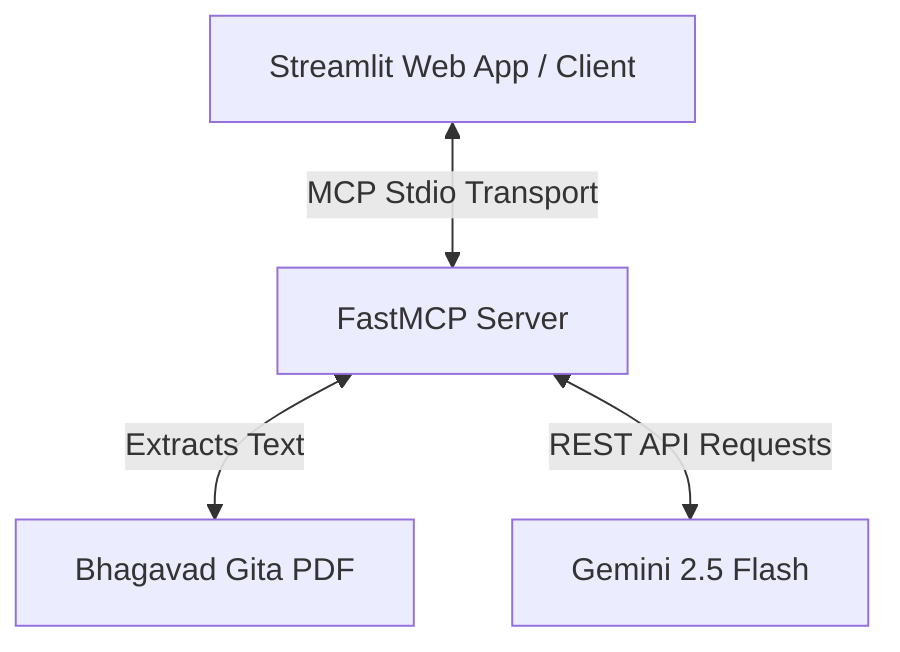

# 🪷 Gita Gnana — Bhagavad Gita AI Assistant

**Gita Gnana** is a premium, context-grounded philosophical assistant powered by the **Model Context Protocol (MCP)** and **Gemini 2.5 Flash**. It provides spiritual guidance and answers life-related questions (ethics, selflessness, mindfulness, and karma) strictly and exclusively using a provided Bhagavad Gita commentary PDF.

---

## 🏗️ Architecture

The project is built on a decoupled **Client-Server architecture** using the **Model Context Protocol (MCP)**:



1. **FastMCP Server (`gita_gnana_server.py`)**: 
   - Uses `fastmcp` to expose Python functions as standardized tools.
   - Extracts and indexes the commentary PDF using `pypdf`.
   - Interacts directly with the Gemini Developer API to generate context-grounded responses.
2. **Streamlit UI Client (`app.py`)**:
   - A premium web interface with sleek, responsive CSS overrides, gold accents (`#FFD700`), and dark-themed glassmorphism.
   - Integrates with the MCP server in a separate thread using the `fastmcp` Client over the stdio transport.

---

## ✨ Features

- 🧘 **Zero-Hallucination Grounding**: Answers are strictly confined to the provided Bhagavad Gita PDF. If the answer cannot be found in the text, it gracefully falls back stating it is not covered.
- 🛠️ **Model Context Protocol Integration**: Exposes self-documenting server tools (`get_pdf_text`, `answer`, `update_system_prompt`) using python type hints and docstrings.
- 🎨 **Premium UX Design**:
  - Custom glassmorphic styles with clear-view, golden chat inputs.
  - Sidebar excerpt viewer for the raw PDF source.
  - Dynamic chat history with custom avatars (`🧘` for the assistant and `👤` for the user).
- 🔄 **In-Memory Custom Prompts**: Allows users or client scripts to dynamically adjust the system instructions at runtime.

---

## 🛠️ Setup & Installation

### 1. Prerequisites
- **Python 3.10+**
- A **Gemini API Key** (obtainable via Google AI Studio)
- A **Bhagavad Gita PDF** document

### 2. Clone and Install Dependencies
```bash
git clone https://github.com/your-username/gita-gnana-assistant.git
cd gita-gnana-assistant/GitaGnanaApp
pip install streamlit fastmcp pypdf requests python-dotenv
```

### 3. Environment Configuration
Create a `.env` file inside the `GitaGnanaApp` folder:
```env
GEMINI_API_KEY=your_gemini_api_key_here
GITA_PDF_PATH="C:/path/to/your/bhagavad-gita-commentary.pdf"
```

---

## 🚀 Running the Application

### Launching the Streamlit Web Application
Run the Streamlit app directly, which will automatically spin up the FastMCP server as a background subprocess:
```bash
streamlit run app.py
```

### Running the CLI Client Demo
If you want to test the server directly using a CLI script:
```bash
python client_gita_gnana.py
```

---

## 🧩 MCP Tools Reference

The server exposes the following tools to any connected client:

| Tool Name | Parameters | Return Type | Description |
|---|---|---|---|
| `get_pdf_text` | None | `str` | Extracts and returns the full text of the configured Bhagavad Gita PDF. |
| `answer` | `question` (`str`) | `str` | Grounded LLM reasoning that answers a question solely using the PDF context. |
| `update_system_prompt` | `new_prompt` (`str`) | `str` | Replaces the active system prompt in memory (returns the previous prompt). |
